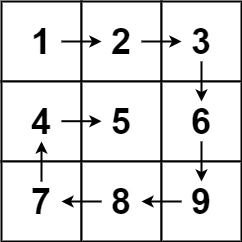

## 📌 Table of Contents
1. [Set Matrix Zeroes](#1-set-matrix-zeroes)
2. [Spiral Matrix](#2-spiral-matrix)
3. [Rotate Image](#3-rotate-image)
4. [Word Search](#4-word-search)


# 1. Set Matrix Zeroes

Given an `m x n` integer matrix `matrix`, if an element is `0`, set its entire row and column to `0`'s.

You must do it **in place**.

## Example 1:


**Input:**  
```plaintext
matrix = [[1,1,1],[1,0,1],[1,1,1]]
```
**Output:**  
```plaintext
[[1,0,1],[0,0,0],[1,0,1]]
```

## Example 2:


**Input:**  
```plaintext
matrix = [[0,1,2,0],[3,4,5,2],[1,3,1,5]]
```
**Output:**  
```plaintext
[[0,0,0,0],[0,4,5,0],[0,3,1,0]]
```

## Constraints:

- `m == matrix.length`
- `n == matrix[0].length`
- `1 <= m, n <= 200`
- `-2^31 <= matrix[i][j] <= 2^31 - 1`

---

## Practice

[Leetcode](https://leetcode.com/problems/set-matrix-zeroes/description/)

## Solution

### Approach 1: Using Extra Space (O(m + n) Space)
```cpp
class Solution {
public:
    void setZeroes(vector<vector<int>>& matrix) {
        int m = matrix.size();
        int n = matrix[0].size();

        vector<int> markRow(m, 1);
        vector<int> markCol(n, 1);

        for(int i = 0; i < m; i++) {
            for(int j = 0; j < n; j++) {
                if(matrix[i][j] == 0) {
                    markRow[i] = 0;
                    markCol[j] = 0;
                }
            }
        }

        for(int i = 0; i < m; i++) {
            for(int j = 0; j < n; j++) {
                if(markRow[i] == 0 || markCol[j] == 0) {
                    matrix[i][j] = 0;
                }
            }
        }
    }
};
```

### Approach 2: Optimized (O(1) Extra Space)
```cpp
class Solution {
public:
    void setZeroes(vector<vector<int>>& matrix) {
        int m = matrix.size();
        int n = matrix[0].size();

        int col0 = 1;

        for(int i = 0; i < m; i++) {
            for(int j = 0; j < n; j++) {
                if(matrix[i][j] == 0) {
                    matrix[i][0] = 0;
                    if(j != 0) {
                        matrix[0][j] = 0;
                    } else {
                        col0 = 0;
                    }
                }
            }
        }

        for(int i = 1; i < m; i++) {
            for(int j = 1; j < n; j++) {
                if(matrix[0][j] == 0 || matrix[i][0] == 0) {
                    matrix[i][j] = 0;
                }
            }
        }

        if(matrix[0][0] == 0) {
            for(int i = 0; i < n; i++) {
                matrix[0][i] = 0;
            }
        }

        if(col0 == 0) {
            for(int i = 0; i < m; i++) {
                matrix[i][0] = 0;
            }
        }
    }
};
```

[🔼 Back to Top](#-table-of-contents)


# 2. Spiral Matrix

## Problem Statement
Given an `m x n` matrix, return all elements of the matrix in spiral order.

## Example 1:



**Input:**  
```
matrix = [[1,2,3],[4,5,6],[7,8,9]]
```
**Output:**  
```
[1,2,3,6,9,8,7,4,5]
```

## Example 2:


**Input:**  
```
matrix = [[1,2,3,4],[5,6,7,8],[9,10,11,12]]
```
**Output:**  
```
[1,2,3,4,8,12,11,10,9,5,6,7]
```

## Constraints:
- `m == matrix.length`
- `n == matrix[i].length`
- `1 <= m, n <= 10`
- `-100 <= matrix[i][j] <= 100`

## Practice
[Leetcode](https://leetcode.com/problems/spiral-matrix/description/)

## Solution
```cpp
class Solution {
public:
    vector<int> spiralOrder(vector<vector<int>>& matrix) {
       int l = 0, t = 0;
       int r = matrix[0].size() - 1;
       int b = matrix.size() - 1;
       vector<int> ans;

       while (l <= r && t <= b) {
            for (int i = l; i <= r; i++) {
                ans.push_back(matrix[t][i]);
            }
            t++;

            for (int i = t; i <= b; i++) {
                ans.push_back(matrix[i][r]);
            }
            r--;

            if (t <= b) {
                for (int i = r; i >= l; i--) {
                    ans.push_back(matrix[b][i]);
                }
            }
            b--;

            if (l <= r) {
                for (int i = b; i >= t; i--) {
                    ans.push_back(matrix[i][l]);
                }
            }
            l++;
       }
       return ans;
    }
};
```

[🔼 Back to Top](#-table-of-contents)

# 3. Rotate Image

## Problem Statement
You are given an `n x n` 2D matrix representing an image. Rotate the image by 90 degrees (clockwise).

You must rotate the image **in-place**, which means you have to modify the input 2D matrix directly. **DO NOT** allocate another 2D matrix for the rotation.

---

## Examples

### Example 1:


**Input:**
```cpp
matrix = [[1,2,3],[4,5,6],[7,8,9]]
```
**Output:**
```cpp
[[7,4,1],[8,5,2],[9,6,3]]
```

### Example 2:


**Input:**
```cpp
matrix = [[5,1,9,11],[2,4,8,10],[13,3,6,7],[15,14,12,16]]
```
**Output:**
```cpp
[[15,13,2,5],[14,3,4,1],[12,6,8,9],[16,7,10,11]]
```

---

## Constraints
- `n == matrix.length == matrix[i].length`
- `1 <= n <= 20`
- `-1000 <= matrix[i][j] <= 1000`

---

## Practice
[Leetcode](https://leetcode.com/problems/rotate-image/description/)


## Solution

```cpp
class Solution {
public:
    void rotate(vector<vector<int>>& matrix) {
        int n = matrix.size();

        // Step 1: Reverse the matrix along the horizontal axis
        for(int i = 0; i < n / 2; i++) {
            for(int j = 0; j < n; j++) {
                int temp = matrix[i][j];
                matrix[i][j] = matrix[n - i - 1][j];
                matrix[n - i - 1][j] = temp;
            }
        }

        // Step 2: Transpose the matrix (swap across diagonal)
        for(int i = 0; i < n; i++) {
            for(int j = 0; j < n; j++) {
                if(i < j) {
                    int temp = matrix[i][j];
                    matrix[i][j] = matrix[j][i];
                    matrix[j][i] = temp;
                }
            }
        }
    }
};
```

[🔼 Back to Top](#-table-of-contents)


# 4. Word Search

## Problem Statement
Given an `m x n` grid of characters (`board`) and a string (`word`), return `true` if `word` exists in the grid.

The word can be constructed from letters of sequentially adjacent cells, where adjacent cells are horizontally or vertically neighboring. The same letter cell may not be used more than once.

## Examples

### Example 1

**Input:**
```cpp
board = [["A","B","C","E"],["S","F","C","S"],["A","D","E","E"]]
word = "ABCCED"
```
**Output:**
```cpp
true
```

### Example 2

**Input:**
```cpp
board = [["A","B","C","E"],["S","F","C","S"],["A","D","E","E"]]
word = "SEE"
```
**Output:**
```cpp
true
```

### Example 3

**Input:**
```cpp
board = [["A","B","C","E"],["S","F","C","S"],["A","D","E","E"]]
word = "ABCB"
```
**Output:**
```cpp
false
```

## Constraints
- `m == board.length`
- `n == board[i].length`
- `1 <= m, n <= 6`
- `1 <= word.length <= 15`
- `board` and `word` consist of only lowercase and uppercase English letters.

## Practice
[Leetcode](https://leetcode.com/problems/word-search/description/)

## Solution
```cpp
class Solution {
private:
    bool dfs(int i, int j, int row, int col, vector<vector<char>>& board, string& word, int index) {
        if (index >= word.length()) return true;
        if (i < 0 || j < 0 || i == row || j == col) return false;
        if (board[i][j] != word[index]) return false;
        
        char currChar = board[i][j];
        board[i][j] = '*';
        int op1 = dfs(i + 1, j, row, col, board, word, index + 1);
        int op2 = dfs(i, j + 1, row, col, board, word, index + 1);
        int op3 = dfs(i - 1, j, row, col, board, word, index + 1);
        int op4 = dfs(i, j - 1, row, col, board, word, index + 1);
        board[i][j] = currChar;
        
        return op1 || op2 || op3 || op4;
    }
public:
    bool exist(vector<vector<char>>& board, string word) {
        int row = board.size();
        int col = board[0].size();
        
        for (int i = 0; i < row; i++) {
            for (int j = 0; j < col; j++) {
                if (dfs(i, j, row, col, board, word, 0)) return true;
            }
        }
        return false;
    }
};
```


[🔼 Back to Top](#-table-of-contents)